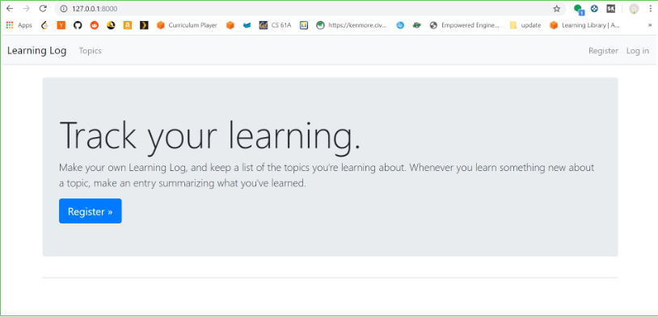
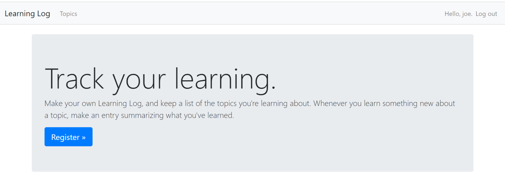
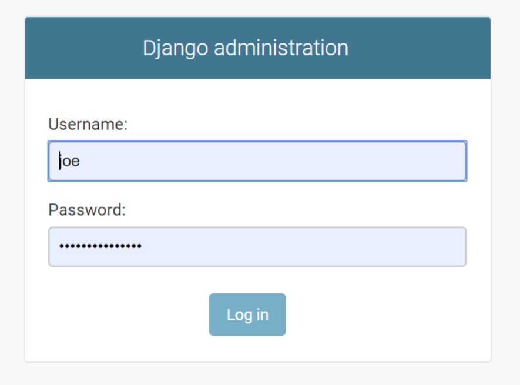
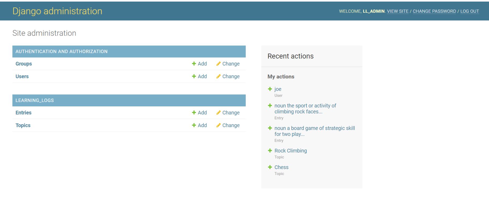
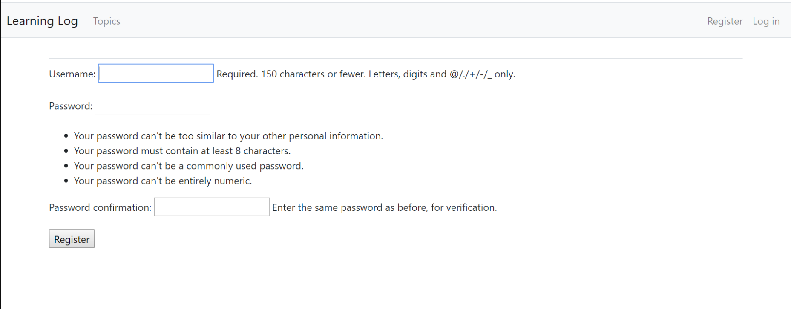
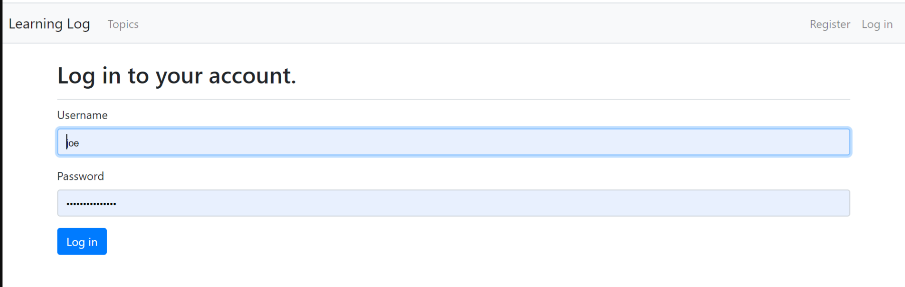
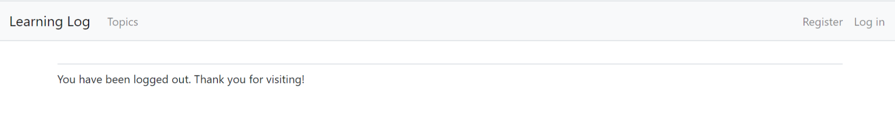

# Web Applications

## Chapter 18: GETTING STARTED WITH DJANGO
* Setting Up a Project
* Starting an App
* Making Pages: The Learning Log Home Page
* Building Additional Pages

## Chapter 19: USER ACCOUNTS
* Allowing Users to Enter Data
* Setting Up User Accounts
* Allowing Users to Own Their Data

## Chapter 20: STYLING AND DEPLOYING AN APP
* Styling Learning Log
* Deploying Learning Log

### Screen-shots

*Image of log in page*

*Image of log in page*	
		

*Image of admin log in*

*Image of admin main page*

*Image of new user register page*

*Image of user login*

*Image of user logout*
